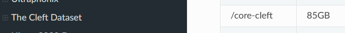

Having attended the meeting with Dr. Brian Cohn 1/24 today. I looked into more of what he mentioned during our meeting. Mainly on the speech processing side, which turns out you can actually apply ML to solve certain problems in identifying hypernasality which kinda threw me off. Since after the meeting I just tossed the idea of ML out the window, with just building the MVP in mind but more of that later.

In regards to actually processing raw audio file, I was able to do so with Python's librosa library. And I used this [Kaggle page](https://www.kaggle.com/code/robikscube/working-with-audio-in-python#Frequency-(Hz)) as reference for any code I was doing.

And according to this [paper](https://www.sciencedirect.com/science/article/abs/pii/S0165587620302500#:~:text=It%20is%20reported%20as%20a,signal%20%5B10%2C11%5D)
> The device provides an acoustic measure of nasality by quantifying the amount of acoustic energy emitted from the nose, calculated as the proportion of nasal to oral sound pressure level (SPL). It is reported as a percentage, based on the formula: nasalance (%) = nasal SPL/(nasal SPL + oral SPL) x 100. The higher the nasalance score, the more nasal sound pressure is present in the speech signal [10,11].

And some [wikipedia](https://en.wikipedia.org/wiki/Sound_pressure#Sound_pressure_level) reading, sound pressure level is just a fancy term for dB units. Which you can get from the bitstream of the audio file.


```py
y, sr = librosa.load(audio_path)

rms = librosa.feature.rms(y=y, frame_length=512)[0] # Get RMS energy
rsp = 20e-6                                         # Reference Sound Pressure
spl_db = 20 * np.log10(rms / rsp)

mean_spl = np.mean(spl_db)
max_spl = np.max(spl_db)
min_spl = np.min(spl_db)
```

So in theory we can calculate the nasalance score `nasalance (%) = nasal SPL/(nasal SPL + oral SPL) x 100` over the course of the audio file / recorded period for our pediatric patient that easily with just 2 mics.

This is the result of a sample `.wav` file on the internet from someone at Harvard.


I've also came across this [paper](https://haythamfayek.com/2016/04/21/speech-processing-for-machine-learning.html), which talks more about application in speech processing for ML. 

It was somewhat useful but the thing I was most interested in, was the fact what Dr. Brian Cohn talked about, is verbatim what's in the paper. 

Mainly talks about preprocessing, downsampling data, using Fourier-Transform (since when we sample, we sample at a rate that's very rapid and we want to transform into something that's less time to manage), etc... I'll probably read more on this later in the qtr.

🎉🎉 One last thing, I FOUND A [CLEFT PALATE DATASET](https://ultrasuite.github.io/data/cleft/)! WE'RE SO BACK!! 🎉🎉

Will download the dataset on Friday to check it out if its any good

